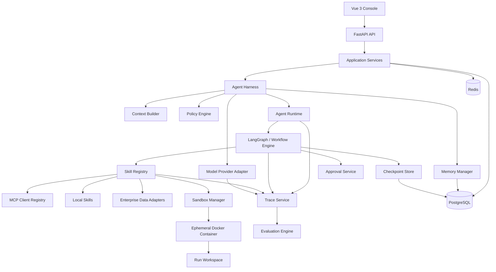
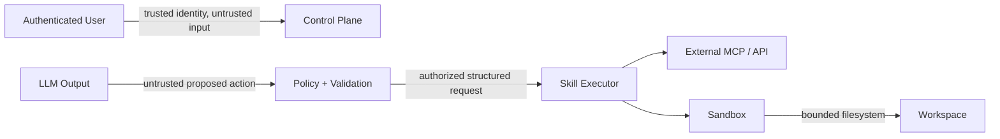
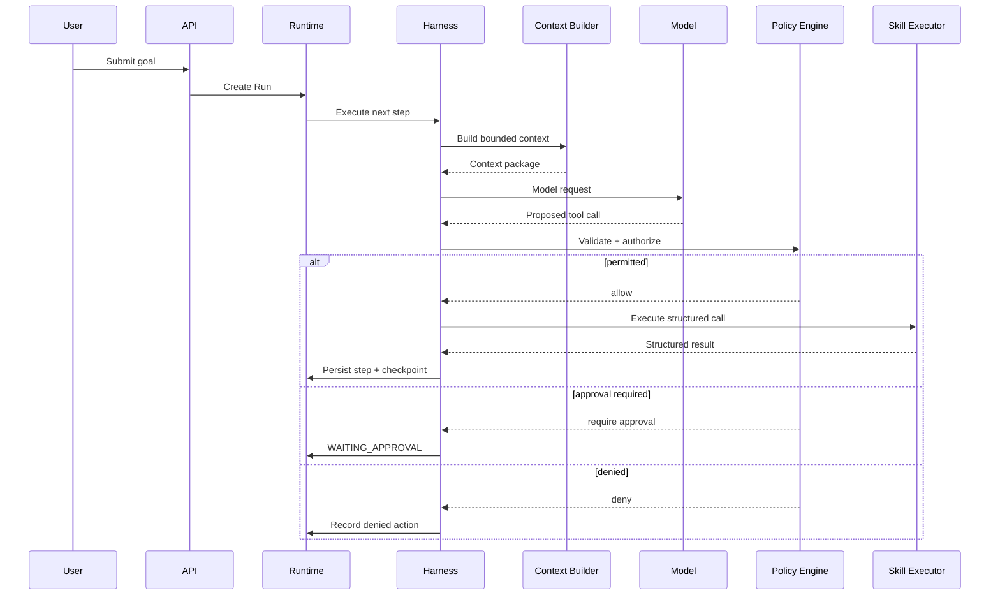

# 01 — System Architecture

## 1. Architectural Style

The first implementation is a modular monolith for the control plane, with externally isolated execution and capability providers.

This keeps transactional boundaries and debugging simple while preserving internal module seams that can later become services if scale requires it.

## 2. Logical Architecture

## 3. Control Plane vs. Execution Plane

### Control Plane

Owns:

- identity and permissions;
- agent definitions;
- skill metadata;
- run state;
- workflow definitions;
- policies and approvals;
- trace/evaluation records.

The FastAPI backend is the initial control plane.

### Execution Plane

Owns bounded execution:

- local skill invocation;
- MCP remote calls;
- sandboxed code execution;
- enterprise connector calls.

Execution never bypasses control-plane authorization.

## 4. Agent Harness Boundary

The Agent Harness is the stable interface between an Agent definition and lower-level runtime capabilities.

Responsibilities:

- resolve Agent/AgentVersion configuration;
- resolve model provider;
- request context assembly;
- bind only allowed/relevant skills;
- invoke the workflow/runtime;
- expose lifecycle hooks for tracing and evaluation;
- normalize model/tool errors.

The Harness must not contain HTTP-specific logic.

## 5. Runtime Boundary

The Runtime owns durable execution semantics:

- Run creation and ownership;
- RunStep transitions;
- checkpoint creation;
- pause/resume/cancel;
- bounded retry;
- failure propagation;
- approval waits;
- finalization.

A model invocation is a step inside a Run, not the Run itself.

## 6. Persistence Strategy

### PostgreSQL

System of record for:

- users, roles, permissions;
- agent/skill/workflow definitions and versions;
- runs, steps and tool calls;
- approvals;
- workspace/artifact metadata;
- long-term memory metadata;
- trace metadata;
- evaluation datasets/results.

### Redis

Used only for ephemeral concerns such as:

- short-lived coordination;
- rate-limit state;
- streaming/pub-sub;
- cache;
- transient locks where justified.

Redis is not the sole source of truth for a Run.

### Vector Search

Phase 8+ starts with pgvector to minimize infrastructure. Qdrant may be introduced only if retrieval scale or operational isolation warrants it.

## 7. Trust Boundaries

Important rule: **LLM output is always treated as untrusted input.**

## 8. Request-to-Action Sequence

## 9. Failure Philosophy

Failures are classified, not flattened into a generic exception:

- validation failure;
- permission denied;
- approval required;
- timeout;
- transient provider failure;
- permanent tool failure;
- sandbox policy violation;
- workflow invariant failure;
- user cancellation.

Only retryable classifications can enter bounded retry.

## 10. Deployment Evolution

### Initial

Docker Compose:

- frontend;
- backend;
- postgres;
- redis;
- sandbox image/runtime dependencies.

### Later

Only split services when a demonstrated scaling or isolation requirement exists. Premature microservices are explicitly avoided.
