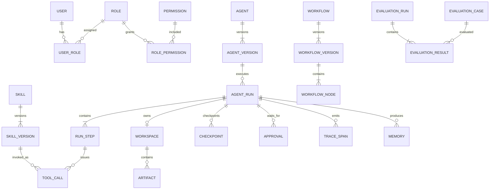

# 02 — Domain Model

## 1. Modeling Principles

- Definitions are versioned when execution reproducibility depends on them.
- Runtime events are immutable where practical.
- Human decisions are first-class domain records.
- Model-generated actions are proposals until validated and authorized.
- Resource ownership is explicit.

## 2. Core Entities

### Identity

#### User

Represents an authenticated principal.

Key fields:

- `id`
- `email / username`
- `status`
- `created_at`

#### Role

Named bundle of permissions.

#### Permission

Atomic capability such as `skill:execute` or `experiment:create`.

---

### Agent Definition

#### Agent

Stable logical identity.

- `id`
- `name`
- `description`
- `status`
- `active_version_id`

#### AgentVersion

Immutable execution configuration.

- `agent_id`
- `version`
- `system_instructions`
- `model_policy`
- `context_policy`
- `workflow_version_id`
- `created_at`

---

### Capability Definition

#### Skill

Stable capability identity.

- `id`
- `name`
- `provider_type`
- `status`
- `active_version_id`

#### SkillVersion

Immutable callable contract.

- input schema;
- output schema;
- permission requirements;
- side-effect class;
- timeout;
- retry policy;
- provider configuration.

#### MCPServer

Connection metadata and health state for an MCP provider.

---

### Runtime

#### AgentRun

One durable execution instance.

Key fields:

- `id`
- `agent_version_id`
- `requested_by_user_id`
- `status`
- `input`
- `current_step_id`
- `started_at`
- `finished_at`
- `error_code`

#### RunStep

One durable state transition or execution unit inside a Run.

Examples:

- PLAN
- MODEL_CALL
- TOOL_CALL
- TOOL_RESULT
- APPROVAL_WAIT
- SANDBOX_EXECUTION
- REVIEW
- FINAL

#### ToolCall

Concrete invocation record.

- selected SkillVersion;
- validated arguments;
- authorization decision;
- idempotency key where required;
- result/error metadata.

#### Checkpoint

Serialized resumable runtime state.

---

### Workspace

#### Workspace

Logical file boundary owned by a Run.

#### Artifact

Output generated by the Run.

Examples:

- report;
- chart;
- CSV;
- JSON result.

---

### Memory

#### Memory

Durable retrievable item.

Memory type:

- conversation;
- task;
- long-term;
- semantic.

Additional fields:

- subject/user/agent scope;
- content;
- embedding reference;
- importance;
- expiration policy;
- source Run.

---

### Workflow

#### Workflow

Stable workflow identity.

#### WorkflowVersion

Immutable graph definition.

#### WorkflowNode

Executable graph node.

Node types may include:

- agent;
- skill;
- branch;
- parallel;
- approval;
- reviewer.

---

### Governance

#### Approval

Human decision record attached to a protected operation.

Status:

- PENDING;
- APPROVED;
- REJECTED;
- EXPIRED;
- CANCELLED.

#### PolicyDecision

Optional persisted record describing allow/deny/approval-required decisions.

---

### Observability

#### TraceSpan

Hierarchical execution span.

Span types:

- model;
- skill;
- MCP;
- sandbox;
- workflow;
- policy;
- memory/context.

#### EvaluationCase

Repeatable test specification.

#### EvaluationRun

Execution of a dataset against a concrete Agent/Workflow candidate.

#### EvaluationResult

Per-case metric/result record.

## 3. Relationship Overview



## 4. Ownership Rules

- A Run is owned by the requesting user/tenant context.
- A Workspace cannot exist independently of its Run.
- A ToolCall always belongs to a RunStep.
- A ToolCall references the exact SkillVersion used, not only the latest Skill.
- An AgentRun references the exact AgentVersion used.
- Evaluation results reference concrete candidate versions to preserve reproducibility.
- Approvals record both requester context and approver identity.

## 5. Versioning Rule

Mutable definitions use stable identity + immutable versions:

```text
Agent -> AgentVersion
Skill -> SkillVersion
Workflow -> WorkflowVersion
```

This is required because a historical Run must remain explainable after a definition changes.

## 6. Identifier Strategy

Use UUID/ULID-style globally unique identifiers for domain entities. Human-readable names are not primary keys.

## 7. Tenant Boundary

The first implementation may be single-tenant in deployment, but entity ownership and query patterns must not prevent adding an explicit `tenant_id` boundary later. No cross-user resource lookup should be implemented without authorization checks.
