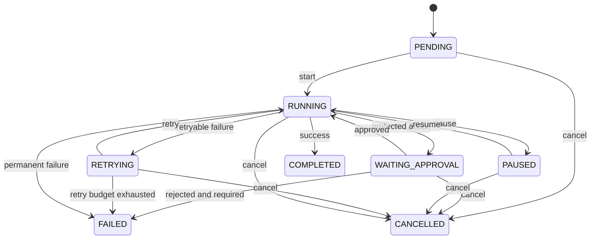
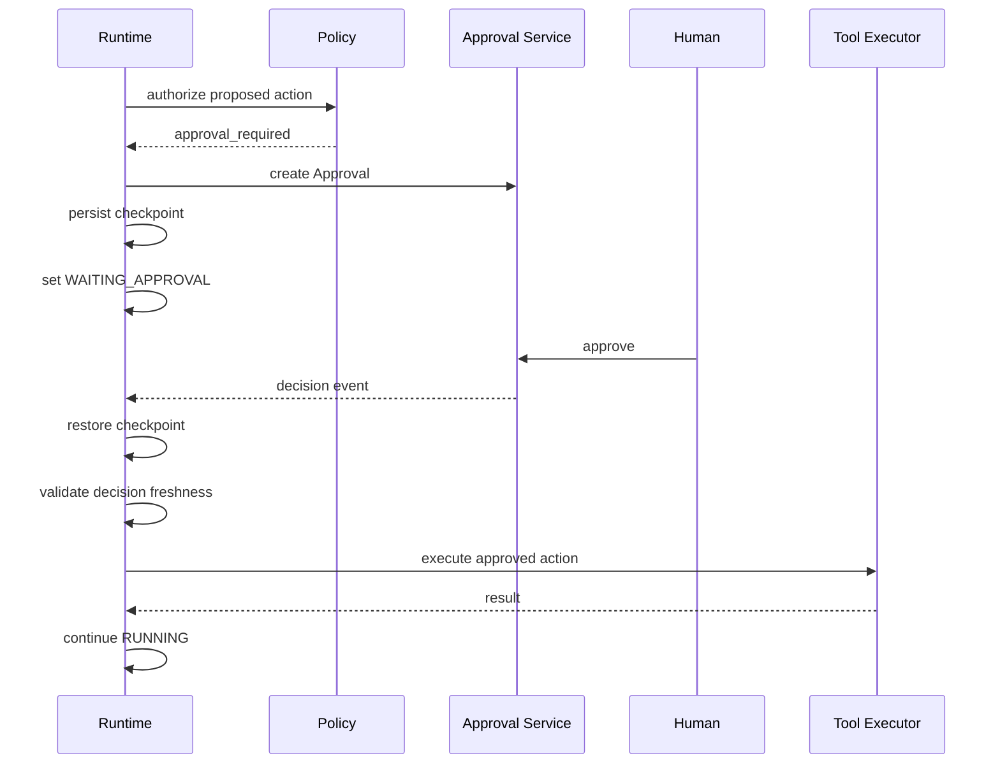

# 03 — Agent Run Lifecycle

## 1. Purpose

A Run is a durable state machine, not a single HTTP request.

The lifecycle must support long-running tasks, interruption, human approval, retries and recovery.

## 2. States

| State | Meaning |
| --- | --- |
| `PENDING` | Accepted but not executing |
| `RUNNING` | Runtime owns active execution |
| `WAITING_APPROVAL` | Suspended until a human decision |
| `PAUSED` | Explicitly paused |
| `RETRYING` | Waiting for or performing a bounded retry |
| `COMPLETED` | Successful terminal state |
| `FAILED` | Unrecoverable terminal failure |
| `CANCELLED` | User/system cancelled terminal state |

## 3. State Machine



## 4. Transition Rules

State transitions must be performed by the Runtime service through a validated transition table. Arbitrary database updates are not allowed.

Examples:

- `COMPLETED -> RUNNING` is invalid.
- `FAILED -> RUNNING` is invalid for the same Run; an explicit retry may create a new attempt/run depending on semantics.
- `WAITING_APPROVAL -> RUNNING` requires an approved Approval record.
- `RUNNING -> RETRYING` requires a classified retryable error and remaining retry budget.

## 5. Step Semantics

A Run contains ordered/directed `RunStep` records.

Suggested step types:

```text
INPUT
PLAN
CONTEXT_BUILD
MODEL_CALL
POLICY_CHECK
TOOL_CALL
TOOL_RESULT
SANDBOX_EXECUTION
APPROVAL_WAIT
MEMORY_WRITE
REVIEW
FINAL
```

A step records:

- start/end timestamp;
- status;
- parent step/span;
- normalized input/output references;
- error class;
- attempt number;
- trace linkage.

## 6. Checkpoint Semantics

A checkpoint captures enough runtime state to continue deterministically from a safe boundary.

Checkpoint candidates:

- after a successful model decision;
- after a side-effect-free tool result;
- before entering approval wait;
- after approval;
- after a side-effecting tool has durably recorded an idempotency result;
- after workflow node completion.

Checkpoint data must not silently include unrestricted secrets.

## 7. Approval Sequence



## 8. Retry Model

Retry is policy-driven and bounded.

A retry policy may define:

- maximum attempts;
- exponential/fixed delay;
- retryable error classes;
- per-tool timeout;
- total step deadline.

Do not automatically retry:

- permission denial;
- schema validation failure caused by stable input;
- rejected approval;
- policy violation;
- known non-idempotent side effects without an idempotency mechanism.

## 9. Cancellation

Cancellation is cooperative and should:

1. mark cancellation requested;
2. stop scheduling new steps;
3. attempt to stop cancellable external/sandbox work;
4. persist final state;
5. preserve trace and artifacts already produced.

## 10. Recovery Invariant

After backend restart, a non-terminal Run must be discoverable from durable storage. Redis-only execution state is therefore insufficient.
