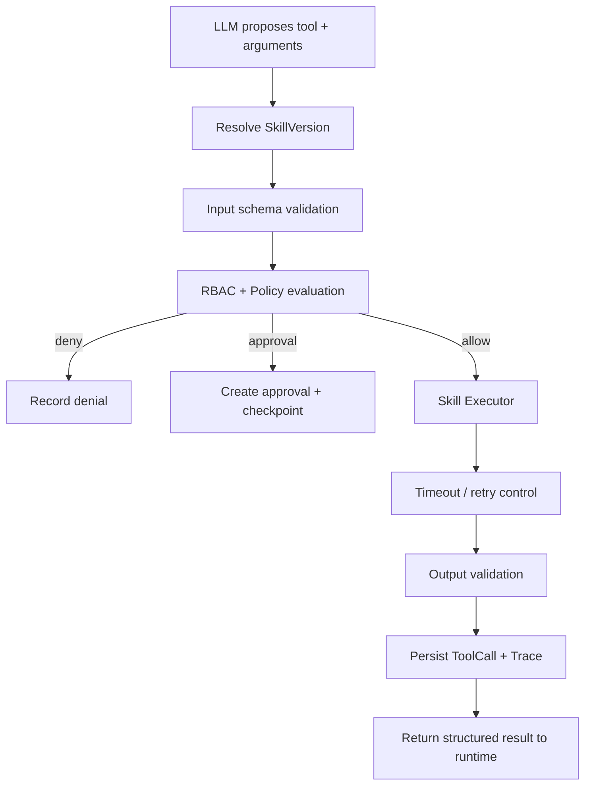

# 04 — Tool / Skill Model

## 1. Terminology

A **Skill** is a platform-managed capability definition.

A **Tool Call** is one runtime invocation of a concrete SkillVersion.

A provider may implement a Skill through:

- local Python code;
- MCP;
- REST;
- controlled database adapter;
- sandbox executor.

## 2. Skill Contract

A SkillVersion should expose a machine-readable contract similar to:

```json
{
  "name": "experiment.search",
  "version": 1,
  "description": "Search historical experiment records",
  "input_schema": {
    "type": "object",
    "properties": {
      "material": {"type": "string"},
      "limit": {"type": "integer", "minimum": 1, "maximum": 100}
    },
    "required": ["material"]
  },
  "output_schema": {
    "type": "object"
  },
  "permissions": ["experiment:read"],
  "side_effect": "read_only",
  "timeout_seconds": 20,
  "retry": {
    "max_attempts": 2
  }
}
```

## 3. Side-Effect Classification

Every skill declares one of:

| Class | Meaning | Default policy |
| --- | --- | --- |
| `READ_ONLY` | Reads without external mutation | execute if authorized |
| `REVERSIBLE_WRITE` | Mutates but can be safely reversed | policy-dependent |
| `IRREVERSIBLE_WRITE` | External side effect difficult/impossible to undo | usually approval-gated |
| `SENSITIVE` | High-impact operation regardless of reversibility | explicit policy/approval |

Side-effect classification is metadata used by Policy; the model cannot override it.

## 4. Invocation Pipeline



## 5. Skill Registry Responsibilities

The registry owns:

- canonical name;
- description;
- provider type;
- active version;
- schema;
- permissions;
- side-effect metadata;
- status/health;
- timeout/retry settings.

It does **not** execute policy decisions itself.

## 6. Dynamic Skill Binding

Do not expose every registered skill to every model call.

Future selection pipeline:

```text
All enabled Skills
      |
      v
Authorization pre-filter
      |
      v
Agent allowed-skill filter
      |
      v
Semantic/metadata relevance retrieval
      |
      v
Small bound Skill set
      |
      v
Model context
```

Benefits:

- lower token cost;
- reduced tool confusion;
- smaller attack surface;
- easier evaluation of tool selection.

## 7. Argument Handling

Tool arguments generated by an LLM are untrusted.

Execution requires:

1. parse structured output;
2. validate against input schema;
3. normalize values where deterministic;
4. reject unknown/disallowed fields;
5. evaluate authorization;
6. optionally require approval;
7. execute.

The platform must never pass raw model text directly to SQL, shell or privileged APIs.

## 8. Idempotency

Side-effecting Skills should support an idempotency key derived from the Run/ToolCall context where the external system supports it.

This prevents duplicate actions when:

- a network response is lost;
- a Run resumes from checkpoint;
- a retry occurs after ambiguous external completion.

## 9. Error Envelope

Providers normalize failures into a common result:

```json
{
  "ok": false,
  "error": {
    "code": "PROVIDER_TIMEOUT",
    "retryable": true,
    "message": "Provider did not respond within 20 seconds"
  }
}
```

Raw provider exceptions are retained in restricted trace/debug metadata, not exposed indiscriminately to the model/user.

## 10. Skill Evaluation

Later evaluation should measure:

- selection accuracy;
- argument accuracy;
- authorization correctness;
- execution success;
- retry behavior;
- latency;
- side-effect safety.
