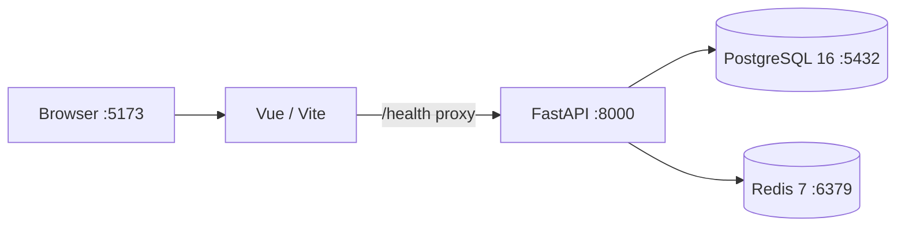

# 07 — Phase 1 Engineering Skeleton

## Status

**Implemented**

Phase 1 turns the Phase 0 architecture into a reproducible development environment without introducing Agent business logic prematurely.

## Deliverables

### Backend

- Python 3.12 project
- FastAPI application
- Pydantic Settings configuration
- async SQLAlchemy engine
- PostgreSQL health probe
- Redis async client and health probe
- Alembic configuration and baseline migration
- pytest health-contract tests
- Ruff and mypy configuration
- backend Docker image

### Frontend

- Vue 3
- TypeScript
- Vite
- Element Plus
- engineering-status landing page
- backend health proxy
- frontend Docker image

### Infrastructure

- PostgreSQL 16
- Redis 7
- Docker Compose dependency health checks
- persistent development volumes
- configurable host ports
- root environment template
- Makefile convenience commands
- GitHub Actions backend/frontend CI

## Runtime Topology



The backend does not report healthy until both PostgreSQL and Redis respond.

## Health Contracts

### Liveness

```http
GET /health/live
```

Only verifies that the HTTP application is alive.

Expected response:

```json
{
  "status": "ok",
  "service": "enterprise-agent-runtime-platform",
  "version": "0.1.0"
}
```

### Dependency Health

```http
GET /health
```

Healthy:

```json
{
  "status": "ok",
  "service": "enterprise-agent-runtime-platform",
  "version": "0.1.0",
  "database": "ok",
  "redis": "ok"
}
```

If a dependency is unavailable, the endpoint returns HTTP 503 and identifies the unavailable dependency.

## Local Startup

From the repository root:

```bash
cp .env.example .env
docker compose up --build
```

The `.env` copy is optional because development defaults are supplied in Compose, but using it makes local overrides explicit.

Open:

- Frontend: `http://localhost:5173`
- Backend OpenAPI: `http://localhost:8000/docs`
- Backend health: `http://localhost:8000/health`

Check service state:

```bash
docker compose ps
```

Expected services:

```text
postgres   healthy
redis      healthy
backend    healthy
frontend   healthy
```

## Development Commands

### Docker

```bash
docker compose up --build -d
docker compose logs -f
docker compose ps
docker compose down
```

### Backend without Docker

Requires local PostgreSQL and Redis:

```bash
cd backend
python3.12 -m venv .venv
source .venv/bin/activate
pip install -e ".[dev]"
alembic upgrade head
uvicorn app.main:app --reload
```

### Backend validation

```bash
cd backend
ruff check app tests
mypy app
pytest
```

### Frontend validation

```bash
cd frontend
npm install
npm run build
```

## Database Bootstrap

Backend container startup performs:

```bash
alembic upgrade head
```

The Phase 1 baseline migration intentionally creates no domain tables. Phase 2 introduces User, Role and Permission tables.

This still creates Alembic's migration version state, ensuring schema evolution starts under migration control rather than ad-hoc SQL.

## Architecture Constraints Preserved

Phase 1 intentionally does **not** add:

- DeepSeek/model calls;
- Agent Harness logic;
- Tool/Skill registry;
- Agent Run tables;
- MCP;
- sandbox execution.

Those are introduced in the roadmap order so infrastructure and security boundaries are not hidden inside prototype code.

## Exit Criteria

Phase 1 is complete when:

1. Docker Compose builds all project images.
2. PostgreSQL and Redis become healthy.
3. Alembic upgrades the backend schema to head.
4. FastAPI starts successfully.
5. `GET /health` reports both dependencies as healthy.
6. Vue starts and can display backend dependency health.
7. backend unit tests/lint/type checking pass.
8. frontend type checking/build passes.
